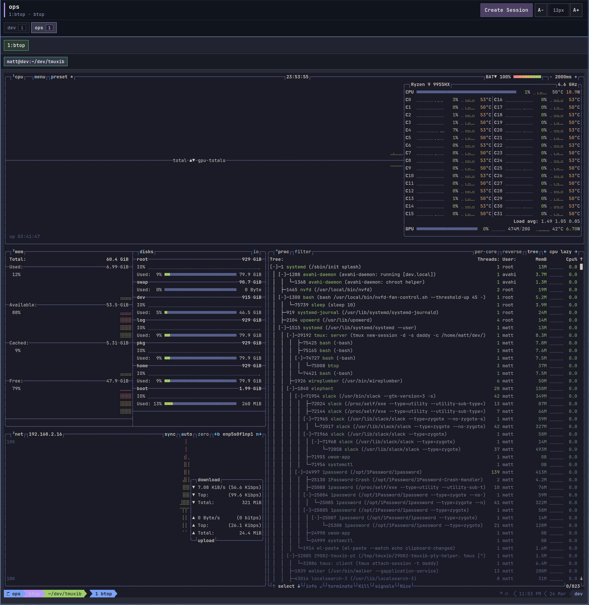

# tmuxib

`tmuxib` is a local-first `tmux in browser` server built with Bun, Hono, Preact, `tmux`, `node-pty`, and `xterm.js`.
It serves the real `tmux` client UI over WebSocket, so the browser is attached to an actual session instead of a fake shell emulator.

## Screenshot



## What it does

- Starts a Bun HTTP and WebSocket server with no framework layer.
- Can be shipped as a single Bun-compiled executable.
- Creates or reuses `tmux` sessions on demand.
- Streams a live terminal backed by a real PTY and real `tmux attach-session`.
- Lists sessions, windows, and panes through a small JSON control plane.
- Splits panes, selects panes or windows, kills panes, and tears down sessions.
- Watches `tmux` control-mode notifications so the browser stays in sync when the layout changes.

## Requirements

- Bun `1.3+`
- Node.js `22+`
- `tmux` `3.2+`
- A POSIX shell such as `/bin/bash` or `/bin/zsh`
- Native build tooling required by `node-pty`

## Quick start

```bash
bun install
bun run dev
```

Open `http://127.0.0.1:3000` in a browser.

`bun run dev` uses Bun hot reload and bundles the browser client on demand:
- runs the Bun server with hot reload
- bundles the browser client on demand through Bun HTML imports

If you want a one-shot local run without the dev watcher:

```bash
bun run start
```

## Scripts

```bash
bun run dev
bun run dev:server
bun run start
bun run build
bun run build:exe
bun run build:server
bun run check
bun run test
```

`bun run build` writes the primary shipping artifact:

- `dist/tmuxib` as a Bun-compiled single executable

Run the compiled binary directly:

```bash
./dist/tmuxib
```

If you also want a non-compiled Bun-targeted bundle for inspection, `bun run build:server` writes it to `dist/server/`.

The single-file build path is currently validated for `linux-x64`, which is the packaged PTY runtime shipped in this repo.

## Environment

Copy `.env.example` if you want to override the defaults.

| Variable | Default | Purpose |
| --- | --- | --- |
| `HOST` | `127.0.0.1` | Bind address |
| `PORT` | `3000` | HTTP and WebSocket port |
| `DEFAULT_SHELL` | `$SHELL` or `/bin/bash` | Shell used for new panes |
| `DEFAULT_CWD` | current process cwd | Working directory for new sessions and panes |
| `TMUX_BIN` | `tmux` | `tmux` executable |
| `SESSION_PREFIX` | `tmuxib` | Prefix for generated session names |

Set `DEBUG_TMUXIB=1` to enable server-side debug logging.

## API surface

- `GET /api/meta`
- `GET /api/sessions`
- `POST /api/sessions`
- `DELETE /api/sessions/:sessionName`
- `GET /api/sessions/:sessionName/state`
- `GET /api/sessions/:sessionName/panes`
- `POST /api/sessions/:sessionName/panes`
- `POST /api/sessions/:sessionName/windows/:windowIndex/select`
- `POST /api/sessions/:sessionName/panes/:paneId/select`
- `DELETE /api/sessions/:sessionName/panes/:paneId`
- `WS /ws/terminal/:sessionName`

## Notes

- The single-file binary still expects a working `tmux` installation on the host machine.
- The executable bundles the frontend assets and the vendored PTY addon into one file; it does not bundle `tmux` itself.
- `tmuxib` has no auth, tenancy, or transport hardening. Treat it as local-only until you put it behind real security controls.
- The browser view is the actual `tmux` client, so native `tmux` keybindings and workflow still apply.
